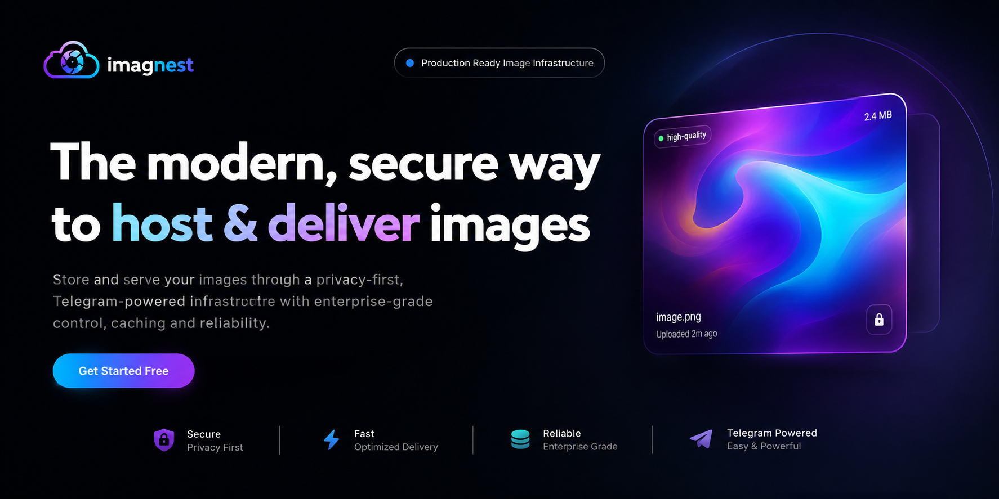

# 📸 Imagnest — Unlimited Cloud Image Hosting & CDN

**Imagnest** is a high-performance, open-source image hosting platform and CDN. It uses Next.js 16, MongoDB, and Telegram's infrastructure to provide free, scalable, and secure cloud media storage.

---

## 🌟 Features

- ⚡ **Custom CDN & On-The-Fly Resizing**  
  Serve images instantly with automatic thumbnail generation (`small`, `medium`, `original`) and smart caching.

- 🔐 **Authentication & Privacy Controls**  
  - Login easily with **Google OAuth** or **Telegram Login** via NextAuth.
  - Set images as **Public** or **Private** with secure access token URLs.

- 📊 **User Dashboard**  
  - Upload & manage image libraries with clean visual previews.
  - Track view counts, bandwidth usage, and active plan quotas.
  - Manage API keys for integration into external apps.

- 🛡️ **Admin Panel**  
  - Moderate uploaded content (approve, flag, or delete images).
  - Manage user roles (User, Admin, Superadmin).
  - System logs and platform analytics.

- 🎨 **Modern Glassmorphic Interface**  
  Designed with Tailwind CSS, Framer Motion animations, and responsive dark mode UI.

---

## 🛠️ Tech Stack

- **Framework:** Next.js 16 (App Router)
- **Frontend:** React 19, Tailwind CSS v4, Framer Motion, Lucide Icons
- **Database:** MongoDB with Mongoose ORM
- **Storage Engine:** Telegram Bot API
- **Auth:** NextAuth.js (Google & Telegram credentials)
- **Deployment:** Vercel

---

## 🚀 Quick Start

### 1. Clone the repository

```bash
git clone https://github.com/omdev04/imagnest.git
cd imagnest
```

### 2. Install dependencies

```bash
npm install
```

### 3. Environment Setup

Create a `.env` file in the root directory and configure the following variables:

```env
# Server Configuration
NEXTAUTH_URL=http://localhost:3000
NEXTAUTH_SECRET=your_nextauth_secret_here

# Database
MONGODB_URI=your_mongodb_connection_string

# Google OAuth
GOOGLE_CLIENT_ID=your_google_client_id
GOOGLE_CLIENT_SECRET=your_google_client_secret

# Telegram Storage Bot
TELEGRAM_BOT_TOKEN=your_telegram_bot_token
TELEGRAM_CHANNEL_ID=your_telegram_channel_id
```

### 4. Run Locally

```bash
npm run dev
```

Open [http://localhost:3000](http://localhost:3000) in your browser.

---

## 🌐 Deploy to Vercel

1. Push your repository to GitHub.
2. Import the project in [Vercel](https://vercel.com).
3. Add your environment variables (`MONGODB_URI`, `NEXTAUTH_SECRET`, `NEXTAUTH_URL`, `GOOGLE_CLIENT_ID`, `GOOGLE_CLIENT_SECRET`, `TELEGRAM_BOT_TOKEN`, `TELEGRAM_CHANNEL_ID`).
4. Click **Deploy**.

---

## ⚠️ Disclaimer & Usage Note

> **Note:** This project utilizes Telegram's Bot API infrastructure as an underlying storage backend. It is developed **strictly for educational, testing, and portfolio/showcase purposes**. It is not intended for commercial production or storing sensitive/critical personal data. Please use responsibly.

---

## 📄 License

Distributed under the MIT License. See `LICENSE` for more information.
